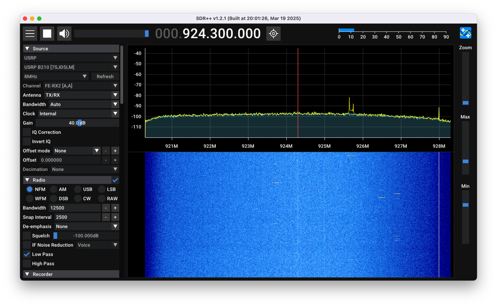

# SDR++ (Enable USRP)

The [official](https://github.com/AlexandreRouma/SDRPlusPlus) build has USRP disabled, so enable USRP and perform the build.

<div align="center">

</div>

## How to build

### MacOS

#### Install dependencies
```sh
brew install cmake pkgconf fftw glfw volk uhd
```

#### Building
```sh
sh build.sh
```